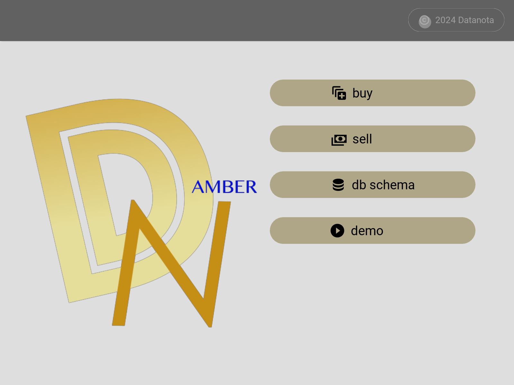

# Datanota-Prototypes AMBER

* Stock Data Source: Excel file

## algorithm 

### Buy 

#### providing an investment dollar amount (default value is $1000)
1. to calculate quantity per stock (considering current price)
2. to calculate percentage change in weighted average price if invested
3. to sort from smallest to largest

### Sell 

#### for all available stocks
1. find the oldest transaction
2. list the oldest unit_price and quantity
3. calculate percentage change in weighted average after selling the oldest entry

