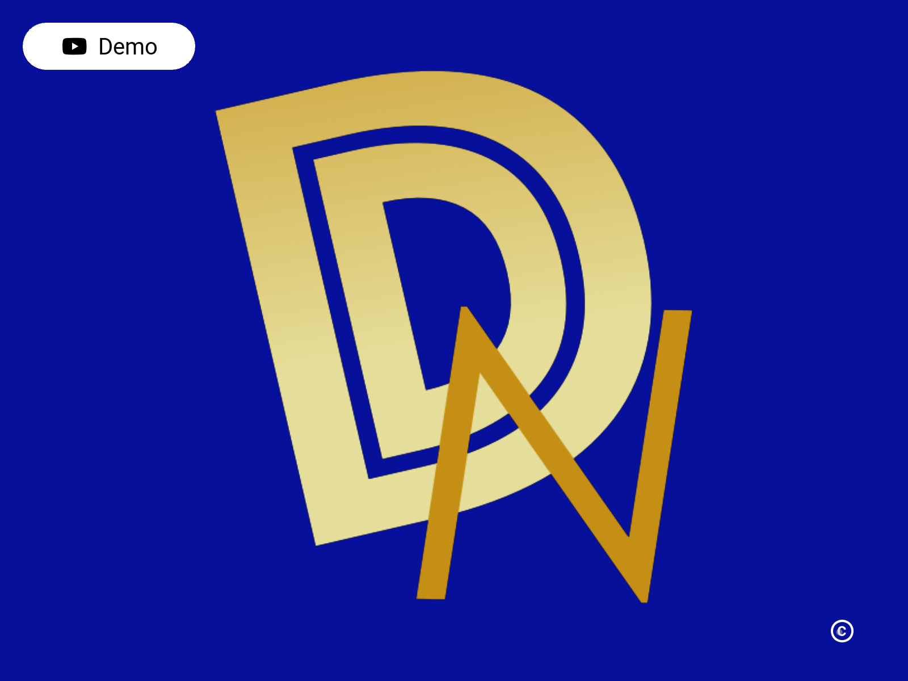
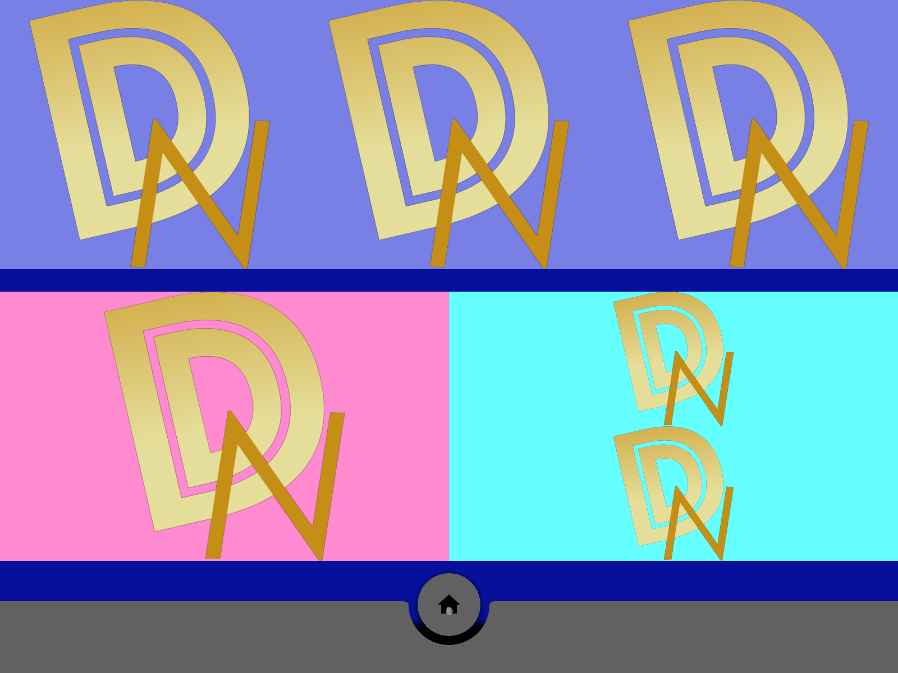
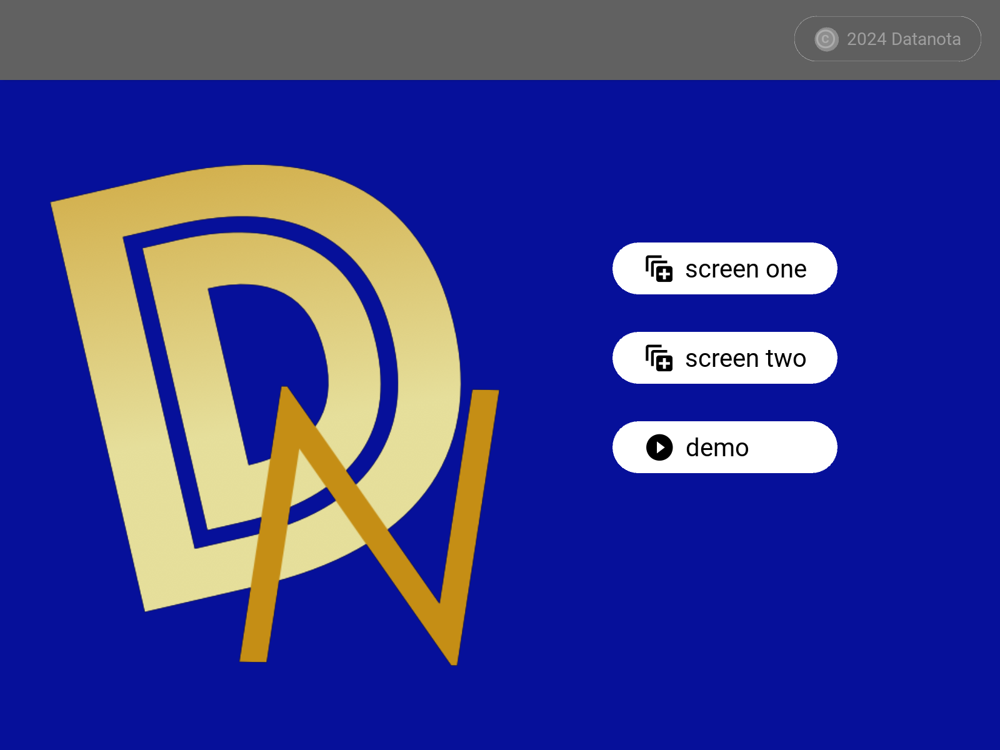
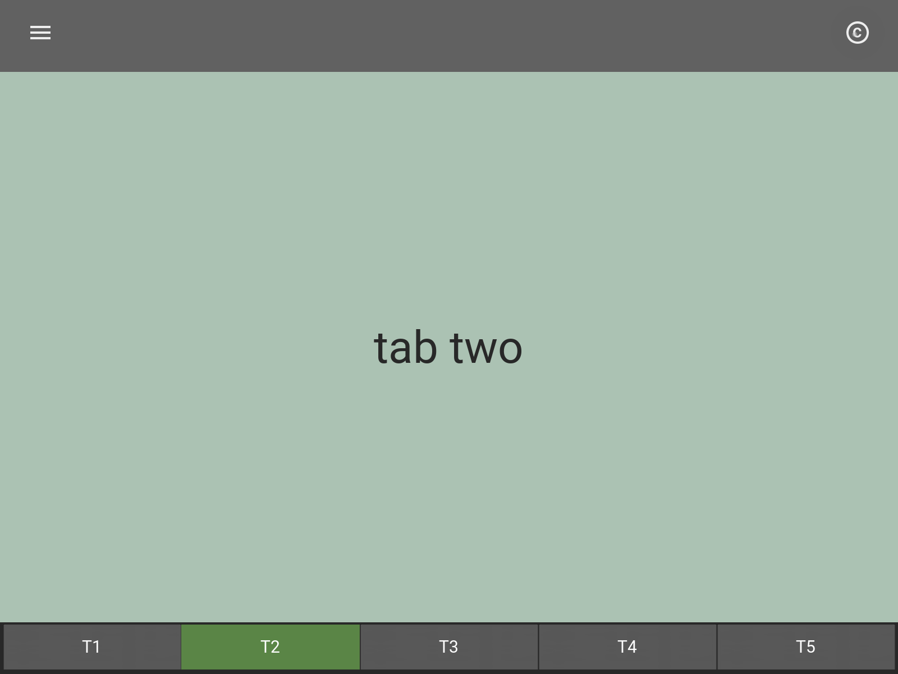
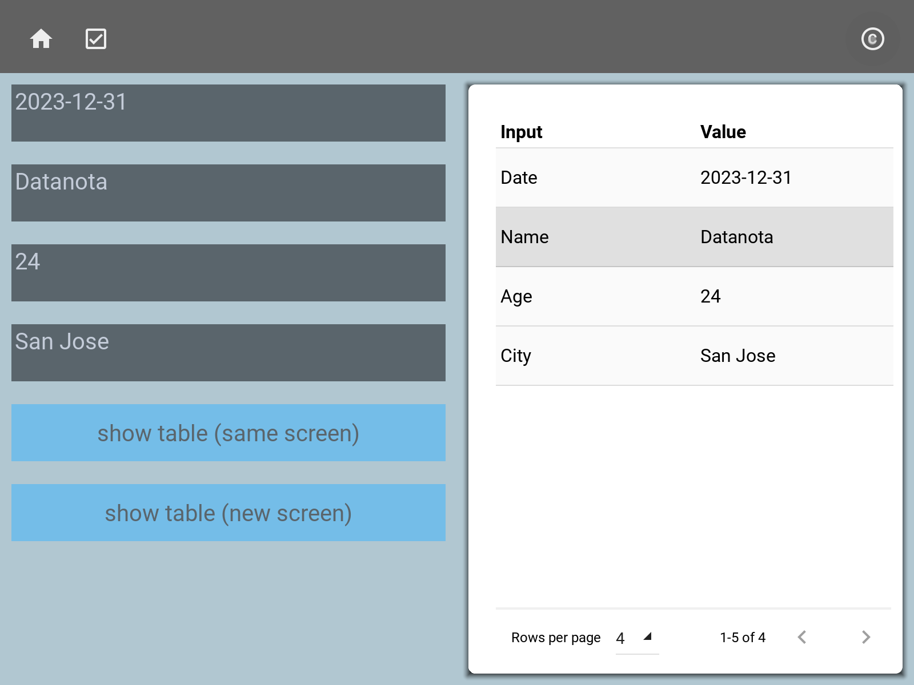

       
# Kivy Widgets

* Name: Datanota-Prototypes Kivy-Widgets
* Description: ready-to-use kivy widgets

 

## chapter 0: quick start

  * one screen app
  * simple layout
  * visit Datanota website by pressing demo button (top-left)
  * image
  * take screenshot by pressing copyright icon button (bottom-right)

 

 

## chapter 1

  * menu icons (top and bottom)
  * copyright icon
  * dialog
  * colorful layouts (Box and Grid Layouts)

 

 

## chapter 2

  * sliding menu 
  * MDRoundFlatIconButton
  * copyright button
  * tabs (default design)
  * tabs (customized)

 

 

## chapter 3

  * input box
  * data table
  * screen updates
  
 

 

